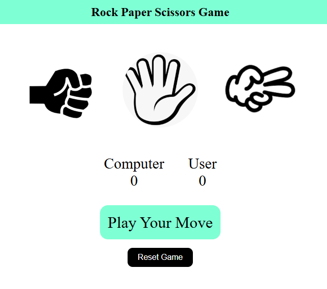
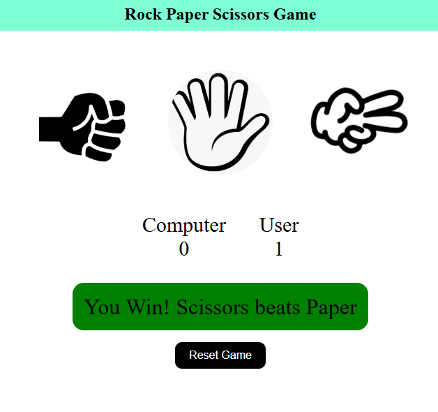
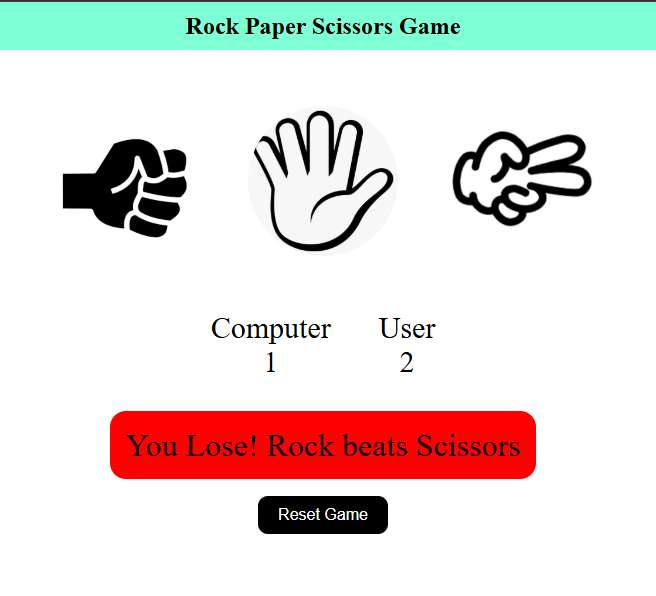
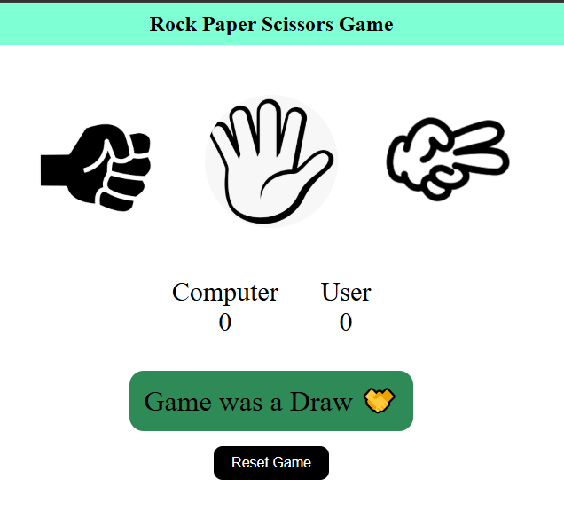

# 🎮 Rock Paper Scissors Game

An interactive Rock Paper Scissors game built using HTML, CSS, and JavaScript.

## 📸 Preview


## 🔗 Live Demo
[🎮 Play Live Game](https://kg-se.github.io/rock-paper-scissors-game/)

## 🚀 Features
- 🎯 Real-time score tracking
- 🤖 Computer AI with delay
- 🔊 Sound effects
- 🔄 Reset game functionality
- 📱 Responsive design

## 🛠️ Technologies Used
- HTML
- CSS
- JavaScript

## 📸 Screenshots

### 🟢 Win Screen


### 🔴 Lose Screen


### 🟡 Draw Screen


## 🎯 How to Play
1. Choose Rock, Paper, or Scissors  
2. Computer will generate its move  
3. Score updates automatically  
4. Use Reset button to restart game  


## 📁 Project Structure
```bash
index.html
style.css
script.js
images/
sounds/
screenshots/
```
## 👨‍💻 Author
**Kashan Ghori**  
🔗 https://github.com/KG-SE

---

💡 This project helped me improve my JavaScript and frontend development skills.
