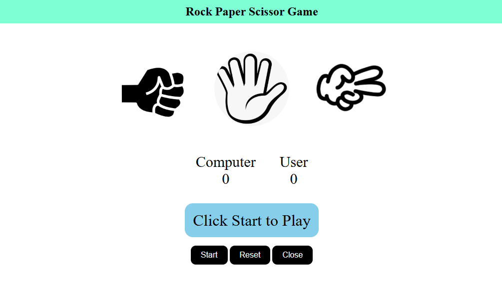
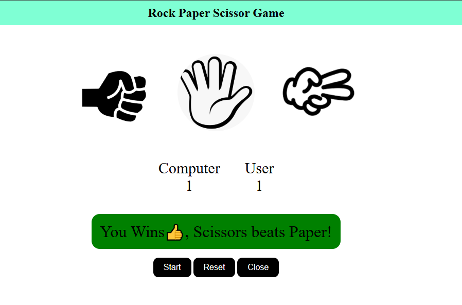
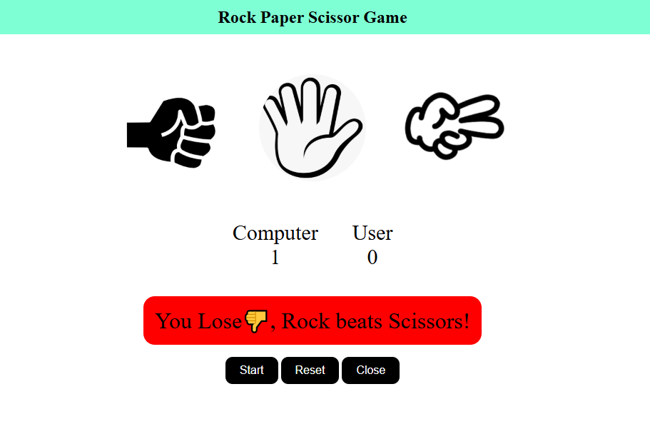
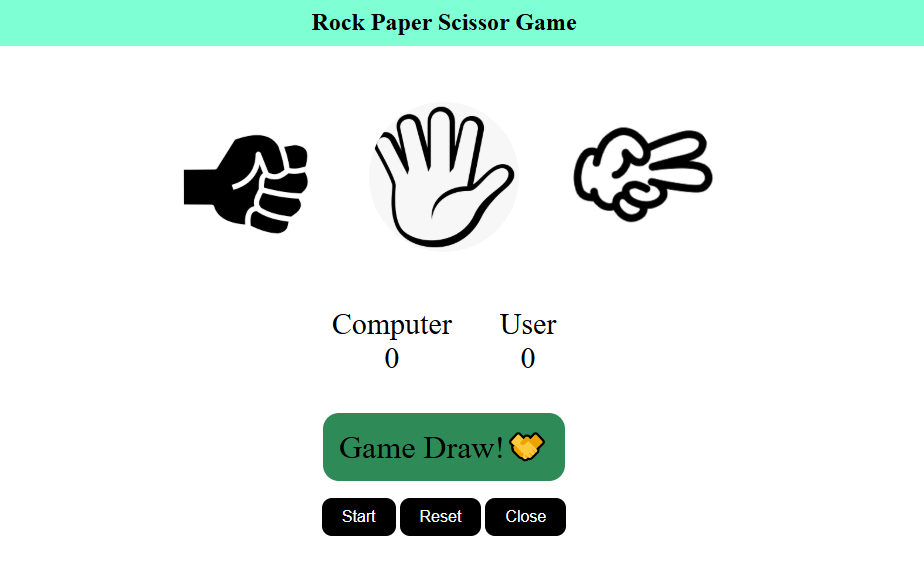
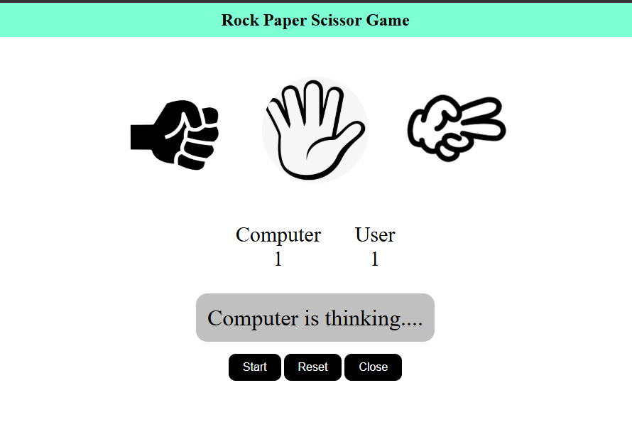

# 🎮 Rock Paper Scissors Game

An interactive Rock Paper Scissors game built using HTML, CSS, and JavaScript (ES6).

## 📸 Preview


## 🔗 Live Demo
[🎮 Play Live Game](https://kg-se.github.io/rock-paper-scissors-game/)

## 🚀 Features
-  Real-time score tracking
-  Computer AI with delay
-  Sound effects
-  Reset game functionality
-  start/close game functionality

## 🛠️ Technologies Used
- HTML
- CSS
- JavaScript (ES6)

## 📸 Screenshots

### 🟢 Win UI


### 🔴 Lose UI


### 🟡 Draw UI


### ⚫ computer thinking UI


## 🎯 How to Play
1. Click on start button to play
2. Choose Rock, Paper, or Scissors  
3. Computer will generate its move  
4. Score updates automatically  
5. Use Reset button to restart game
6. Click on close button to closed the game


## 📁 Project Structure
```bash
index.html
style.css
script.js
images/
sounds/
screenshots/
```
## 👨‍💻 Author
**Kashan Ghori**  
🔗 https://github.com/KG-SE

---

💡 This project helped me improve my JavaScript (ES6) and frontend development skills.

---

## 🤝 Connect with Me

Feel free to connect with me on LinkedIn and check out my projects!

---

⭐ If you like this project, don't forget to star the repository!
